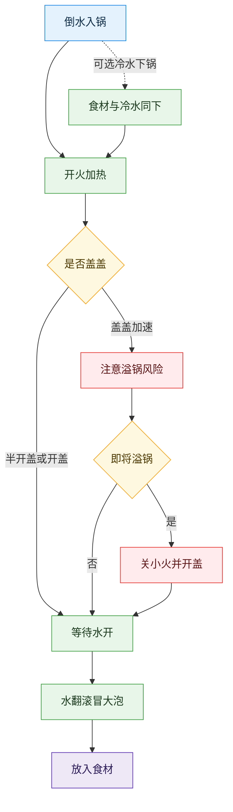

# 煮

## 流程

倒水入锅——开火，将锅放于火上加热——水开（水翻滚，有大量气泡冒出）后放入食材

### 注意事项

* 加热时盖上锅盖可以加快受热。**但这样做有溢锅的风险**。持续加热后，过渡翻腾的流体可能会冒出锅外，这就是溢锅。
* **若即将溢锅，立刻关小火并打开锅盖即可。**
* 想要加快受热又避免溢锅，可以半开锅盖，留出气体出口；也可在后期关小火，并时时注意锅中情况。
* 根据烹饪需要，食材也可冷水下锅。不过这样水烧开需要的时间更久。

## 流程图解

[查看交互版流程图](./diagrams/学习煮.html)
